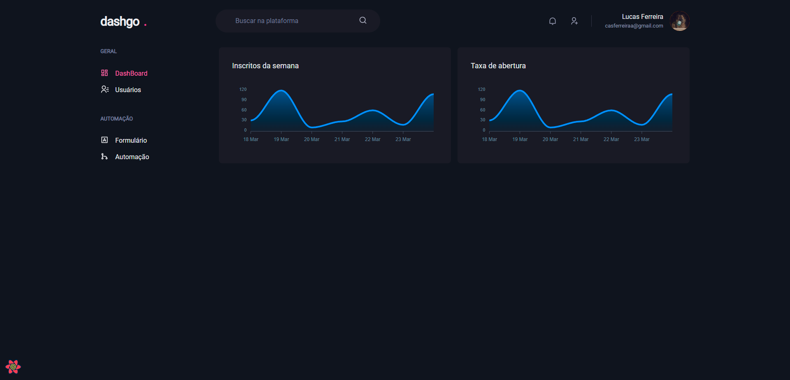
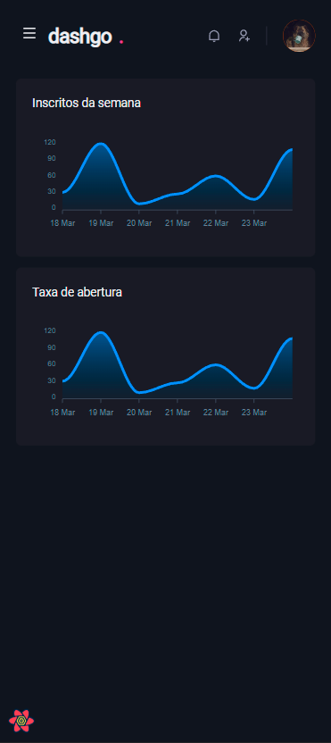

<div align="center">
  

</div>

<p align="center" style="margin-top: 35px">
  
    
</p>


## Sobre o Projeto
Projeto desenvolvido durante a trilha [Rocketseat | Ignite ReactJs](https://www.rocketseat.com.br/). O Exercício consiste em um dashboard responsivo onde exploramos recursos do [NextJs](https://nextjs.org/) e [Chakra UI](https://chakra-ui.com), nele podemos validar os campos de formulário, criar e listar usuários, armazenar e atualizar informações em cache.


### 🛠 Tecnologias
As seguintes ferramentas foram usadas na construção do projeto:

- <a href="https://nextjs.org" > Next.js </a>
- <a href="https://www.typescriptlang.org/"> TypeScript </a>
- <a href="https://chakra-ui.com"> Chakra UI </a>
- <a href="https://apexcharts.com"> Apexcharts.js </a>
- <a href="https://react-hook-form.com"> React Hook Form </a>
- <a href="https://github.com/jquense/yup"> Yup </a>
- <a href="https://react-query.tanstack.com"> React Query </a>
- <a href="https://miragejs.com"> Mirage JS </a>
- <a href="https://github.com/marak/Faker.js/"> Faker </a>

Você precisará de uma conta no [Firebase](https://firebase.google.com/) e configurar o arquivo firebase.js com suas chaves

### 🎲 Rodando o projeto

```bash
# Instale as dependências
$ yarn install
# ou
$ npm install

# Execute a aplicação
$ yarn dev
# ou
$ npm run dev
```